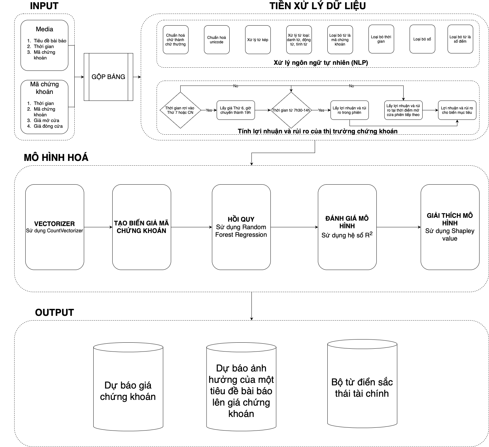
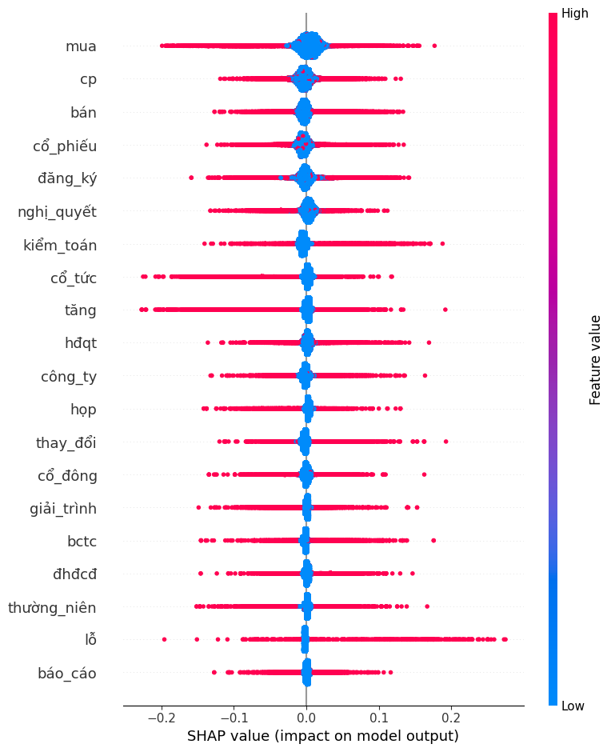

# NLP-and-Stock-forecast-by-Financial-Sentiments

Sử dụng sắc thái ngôn ngữ tài chính để dự báo sự biến động của giá cổ phiếu.

## Cấu trúc file
------------

    ├── data               <- Lưu trữ data
    ├── src                <- Lưu trữ source code.
    ├── setup              <-   NLP.py: file xử lý chữ
                                predict_text.py: file dự báo giá thông qua sắc thái ngôn ngữ
                                app.py: build frontend.
    ├── notebooks          <-   Step1_NLP.ipynb: Tiền xử lý chữ
                                Step2_Calculate_stock_return_and_ volatility.ipynb: Xử lý giá chứng khoán
                                Step3_Vectorizer_and_Cleaning.ipynb: làm sạch và chuẩn hoá vector ngôn ngữ
                                Step4_Modeling_finance_dictionary_Sklearn_Classification.ipynb: Xây dựng mô hình phân lớp dự báo
                                Step4_Modeling_finance_dictionary_Sklearn_Regression.ipynb: Xây dựng mô hình hồi quy dự báo
                                Step5_Prediction_Classification.ipynb: Dự báo theo mô hình phân lớp
                                Step5_Prediction.ipynb: Dự báo theo mô hình hồi quy
                                Step6_SHAP.ipynb: Tính và biểu diễn giá trị SHAP

--------

## Quy trình xử lý ngôn ngữ để dự báo sắc thái tài chính

## Sắc thái ngôn ngữ theo giá trị SHAP

